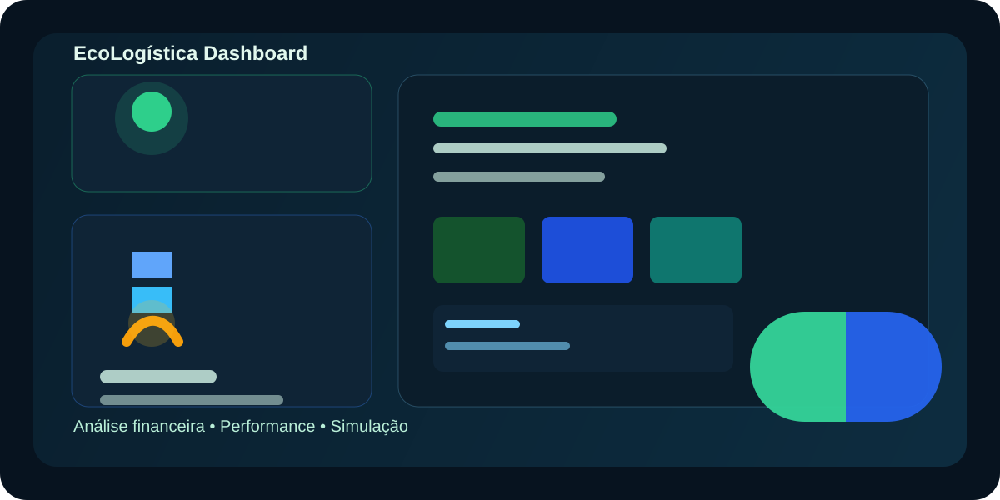

# EcoLogística S.A. Dashboard



> Dashboard de comando centralizado para análise financeira, performance da frota e simulação de cenários operacionais.


## Visão Geral

Este projeto apresenta uma interface interativa e visualmente organizada para acompanhar indicadores-chave de operação logística, incluindo:

- análise financeira com KPIs e gráficos;
- ranking de motoristas e performance da frota;
- simulação de métricas mensais;
- navegação entre páginas com uma experiência moderna e limpa.

## Funcionalidades

- 📊 Painel financeiro com indicadores e evolução mensal;
- 🧭 Navegação por páginas com layout tipo dashboard;
- 👥 Visualização da frota e do ranking de motoristas;
- 🔄 Simulação de métricas com seleção de parâmetro;
- 🎨 Interface responsiva e visualmente refinada.

## Destaques do projeto

- Visual moderno e organizado para apresentação de dados;
- Experiência fluida entre páginas e seções;
- Estrutura preparada para evoluir com mais métricas e recursos.

## Tecnologias

- HTML5
- CSS3
- JavaScript ES modules
- Chart.js

## Como executar localmente

1. Abra a pasta do projeto no VS Code.
2. Execute o arquivo [index.html](index.html) em um navegador.
3. Ou use um servidor simples, como:

```bash
python -m http.server 8000
```

Em seguida, acesse http://localhost:8000.

## Estrutura do projeto

```text
Dashboard/
├── index.html
├── css/
├── js/
├── dados/
└── img/
```

## Autor

Desenvolvido por Renato.
