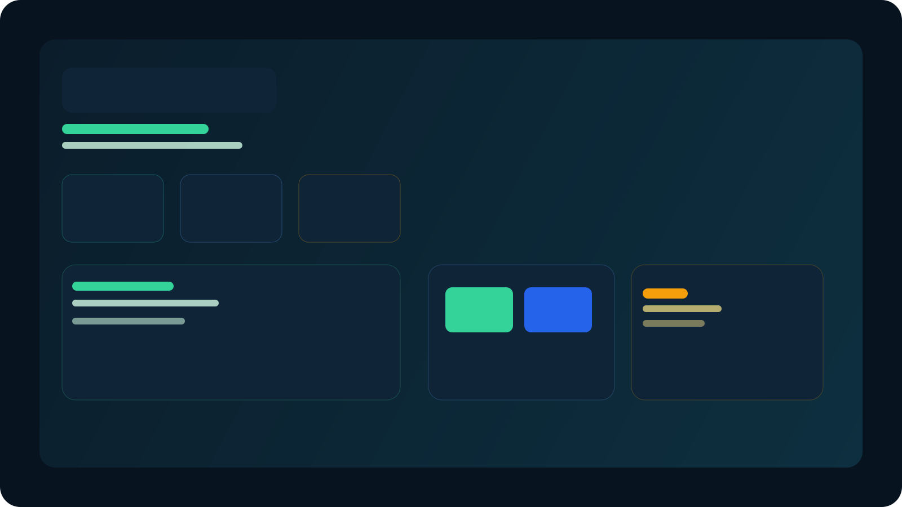

# EcoLogística S.A. Dashboard


> Dashboard interativo para gestão operacional, análise financeira e visualização de performance da frota em tempo de decisão.


## Visão geral

Este projeto apresenta uma interface moderna e funcional para acompanhar indicadores-chave da operação logística, com foco em:

- análise financeira com KPIs e evolução mensal;
- ranking de motoristas e performance da frota;
- simulação de cenários operacionais;
- navegação entre páginas com experiência visual limpa e profissional.

## Funcionalidades principais

- 📊 Painel financeiro com métricas e gráficos comparativos;
- 🧭 Navegação entre páginas com layout tipo dashboard;
- 👥 Visualização da frota e ranking de motoristas;
- 🔄 Simulação de métricas com seleção de parâmetro;
- 🎨 Interface responsiva, elegante e preparada para apresentação.

## Arquitetura e stack

- HTML5 para estrutura semântica;
- CSS3 para design visual e responsividade;
- JavaScript ES modules para organização do código;
- Chart.js para visualização de dados.

## Demo

Veja o projeto em funcionamento online:

- 🌐 [Abrir dashboard em produção](https://renatocosta244.github.io/Dashboard/)



## Como executar localmente

1. Abra a pasta do projeto no VS Code.
2. Execute o arquivo [index.html](index.html) em um navegador.
3. Ou use um servidor simples:

```bash
python -m http.server 8000
```

Depois, acesse http://localhost:8000.

## Estrutura do projeto

```text
Dashboard/
├── index.html
├── css/
├── js/
├── dados/
├── img/
└── assets/
```

## Melhorias aplicadas

- otimização da experiência visual para apresentação no GitHub;
- adição de metadados e favicon para uma presença mais profissional;
- README mais completo e preparado para demonstrar o projeto a recrutadores e clientes.

## Autor

Desenvolvido por Renato.
